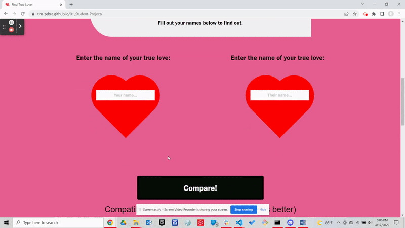

# Compatibile or Not? Find true love here.
UT Bootcamp Collaborative Project 01

## Collaborators:
Timothy Zalewski: https://github.com/Tim-Zebra  
Jace Feinstein: https://github.com/jacef790  
Abigail Asaju: https://github.com/Abigail709  
Robert Leland: https://github.com/RLeland12  

## Description:
A web application that stream lines the dating process by finding love based only on two names!

## How to Use:
To obtain compatibility: Enter your name and their name, then click 'Compare!'  
To obtain jokes: Select the check boxes you want for your search criteria. The click 'Submit Criteria!' to obtain jokes.  
To obtain an activity: Select 'Generate'.  

## Technology Used:
GitHub Repository, 
GitHub Projects, 
VS Code, 
HTML, 
CSS, 
Formation-CSS, 
JavaScript, 
JQuery, 
Google Chrome

## Website Visual Demo(Gif/video):

https://drive.google.com/file/d/1B61MVkG7MmEzSRGXkcF_uf6C7CgrIDZA/view

## Link to Deployed Page:
https://tim-zebra.github.io/01_Student-Project/

## References:
CSS - html, body {} inspired by: Harshit Tewari - https://www.youtube.com/watch?v=OASSKoiCfqY  
Checkboxes inspired by: jQuery UI - https://jqueryui.com/checkboxradio/

## Development Process:
Submitted project proposal  
Setup and implemented a Kanban board  
Created/Setup group github Repo  
Wireframed HTML  
Wireframed JS  
Created HTML layout  
Created JS to script page interaction  
Applied Formation-CSS to webdesign  
Quality Assurance  